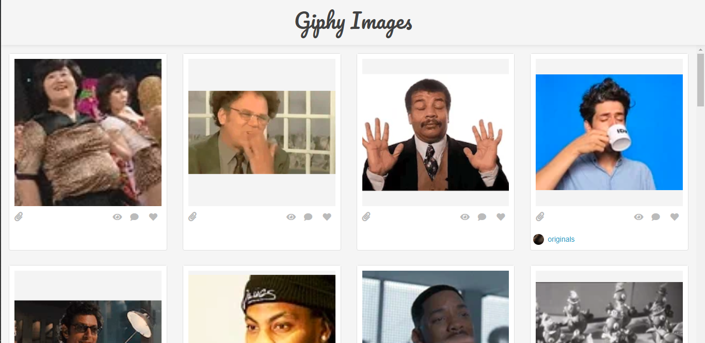
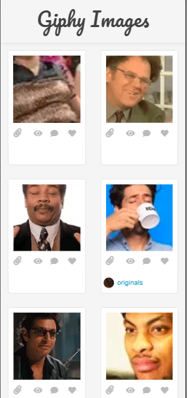

# Giphy Assignment

Implement an image list fetched from Giphy with lazy load scrolling

## Getting Started

### Prerequisites

You need to install yarn > 1.2 and npm 6.x.x

### Installing

```
yarn
yarn start
```

After run all above commands. Access to application by url:
http://localhost:3000

You will see the application show as below pictures (Mobile and Desktop version)





## Running the tests

Not implement Test yet.

## Authors

- **Lương Nhật Duy** - *endiluong@gmail.com* - [Github Repositories](https://github.com/endiluong/message-media-asm)
